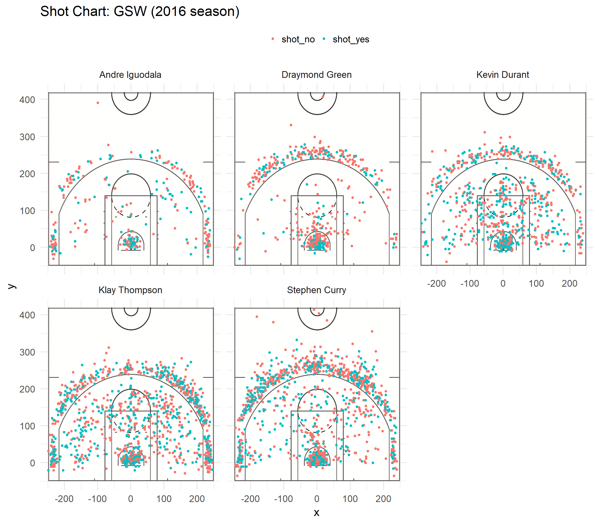

workout01-david-choi
================
David Choi

Report on the shot data of five players from the Golden State Warriors
======================================================================

Introduction
------------

When a basketball player makes a shot, the score will be determined based on the distance from the basket to the player. Depending on the player, some players will be more likely to successfully throw the ball into the basket when they throw from the close distance, which is two-point worth, and others will relatively do better from the far distance, which is three-point worth. In this report, I examined the shot data of five star-players from the Golden State Warriors (GSW) in the 2016 season and calculated and visualized their shot success rates based on distances - two-point zone and three-point zone and the overall success rate.

Method
------

First, I downloaded shot data of Andre Iguodala, Draymond Green, Kevin Durant, Klay Thompson, and Stephen Curry from the GSW in the 2016 season.

 *Andre Iguodala*

 *Draymond Green*

 *Kevin Durant*

 *klay Thompson*

 *Stephen Curry*

Each data set contains the team name, date of the game of a shot, season, period, remaining minutes before the period ends, remaining seconds before the period ends, flag indicating whether a shot was made or not, type of basketball move, shot type - either two-point shot or three-point shot, distance from the basket, opponent team name, and x and y coordinates of the court where a shot occurred. Using RStudio, I edited columns so that it would be easier to manipulate Each set provides enough information, but there were one major and two minor problems. Since these data sets don't contain name of a player, it would be problematic when they are all combined. In addition, the remaining minutes and the value for the flag are not easy to understand at glance. Thus, I added two new columns for the name of a player and the remaining minutes with respect to the total game time. I also replaced values for the flag column(**y**/**n**) to "shot\_yes" for y and "shot\_no" for n. After Data preparation, I first visualized data into graph using ggplot functions and then calculated actual numeric percentages.

Visualization and Analysis
--------------------------

Using scatter plot and x-y coordinates, I visualized locations of the players where they threw the ball. The image of the basketball court was also added as a background, and points were colored depending on the flag for easier visualization. 

*Andre Iguodala*

The shot chart of Andre Iguodala, in general, shows that he missed about the half of his shots. The clustered green points around the basket image (coordinate: 0, 0) indicates that he was most likely succeed in scoring when he threw underneath the basket. However, as he threw farther and farther away from the basket, the probability of him scoring decrease. The graph illustrates that more than half of the times, he failed to score when he threw behind the three-point line.

*Draymond Green*

The shot plot of Draymond Green first shows that he threw more times than Andre Iguodala as there are more points on the plot. It also clearly shows that red points are dominant over green points, indicating his probability of scoring points is less than 50%.

*Kevin Durant*

The points on the plot of Kevin Durant are more spread over the court than previous two graphs. Although the distributions of two colors of the points similar, he was more likely to make shots inside the three-point line than he did behind the line.

*Klay Thompson*

Klay Thompson's graph is also well distributed. The distribution illustrates that he didn't have a preference of location where he threw the shots.

*Stephen Curry*

The points are clustered around the basket (coordinate: 0, 0) and behind the three-point line. In terms of distribution, there are more green points on the left side (x from -200 to 0), indicating more successes when he threw on the left side than the right side.

Table analysis
--------------

There are three types of table: two-point effective shooting percentage by player, three-point effective shooting percentage by player, and overall effective shooting percentage by player. All three tables include four columns - **name**, total number of shots (**total**), number of successful shots(**made**), and ratio of made to total(**perc\_made**). All rows are arranged in decreasing order by the ratio.

    ## # A tibble: 5 x 4
    ##   name           total  made perc_made
    ##   <chr>          <int> <int>     <dbl>
    ## 1 Andre Iguodala   210   134     0.638
    ## 2 Kevin Durant     643   390     0.607
    ## 3 Stephen Curry    563   304     0.540
    ## 4 Klay Thompson    640   329     0.514
    ## 5 Draymond Green   346   171     0.494

*Two-Point Effective Shooting Percentage by Player* Andre Iguodala is listed at the top row, while Draymond Green is at the bottom. All the players except for Draymond Green, have more than 50% chance of making a shot when they threw on the two-point field.

    ## # A tibble: 5 x 4
    ##   name           total  made perc_made
    ##   <chr>          <int> <int>     <dbl>
    ## 1 Klay Thompson    580   246     0.424
    ## 2 Stephen Curry    687   280     0.408
    ## 3 Kevin Durant     272   105     0.386
    ## 4 Andre Iguodala   161    58     0.360
    ## 5 Draymond Green   232    74     0.319

*Three-Point Effective Shooting Percentage by Player* On this table, Klay Thompson is at the top row, while Draymond Green is still at the bottom. No player had more than 50% chance of making a shot behind the three-point line.

    ## # A tibble: 5 x 4
    ##   name           total  made perc_made
    ##   <chr>          <int> <int>     <dbl>
    ## 1 Kevin Durant     915   495     0.541
    ## 2 Andre Iguodala   371   192     0.518
    ## 3 Klay Thompson   1220   575     0.471
    ## 4 Stephen Curry   1250   584     0.467
    ## 5 Draymond Green   578   245     0.424

*Overall Effective Shooting Percentage by Player* Overall, Kevin Durant had the highest ratio of successful shots to total number of shots, and Draymond Green had the lowest. Although Kevin Durant had not been at the top row in the previous two tables, his shots were mostly thrown within the two-point field (643 in two-point field while 272 in three-point field) where he made about 60% of shots. Kevin Durant's overall ratio of **made** to **total** more than

Conclusion
----------

By looking solely at graph, it was impossible to conclude who had the highest probability of making a shot in the 2016 season among those five players. However, it could be assumed that Draymond Green had the lowest probability as red points were clearly dominant over green points on the plot. From the tables, the assumption is now proven with numerical values. Draymond Green had the lowest probability in all tables. Using tables, it is also possible to see who had the highest probability and exact values. However, it is not safe to conclude that Kevin Durant was the best player and Draymond Green was the worst among five players, for two reasons. First, total numbers of shots of the players were all different. Secondly, some had thrown more balls within the two-point field - easier to make shots in the basket - while the others had thrown more balls behind the three-point line. They all did well in the 2016 season and are one of the best basketball players.
